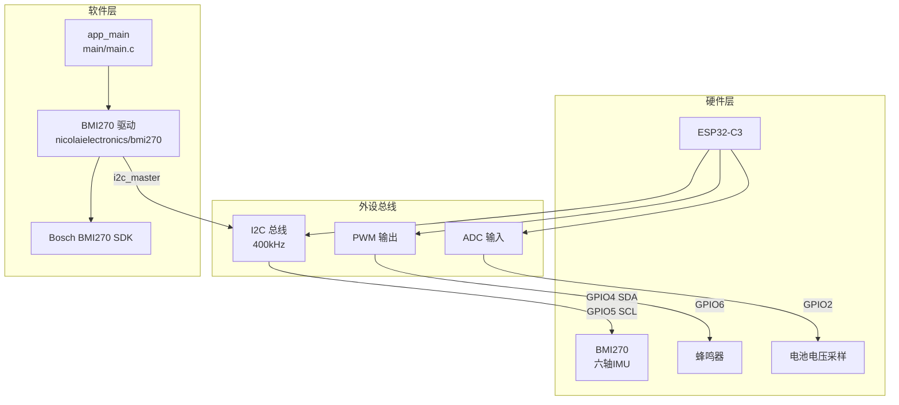
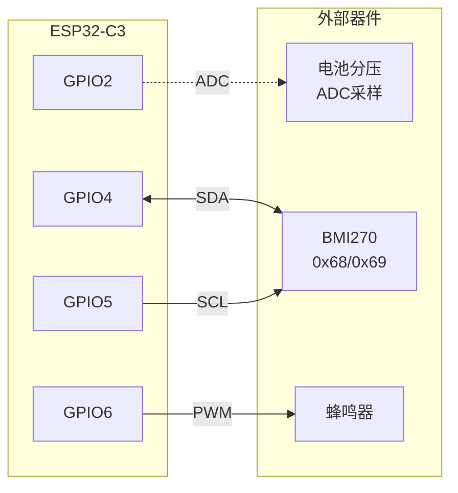

# smartKepp_C3 项目文档

## 项目概览

| 属性 | 值 |
|:---|:---|
| 项目名称 | smartKepp_C3 |
| 目标芯片 | ESP32-C3 |
| 开发框架 | ESP-IDF v5.5.3 |
| 串口 | COM3 |
| 项目阶段 | **极早期** — main.c 为空壳，BMI270 驱动依赖已配置完毕 |

---

## 系统架构图



---

## 硬件连接图



---

## 引脚分配表

| 引脚 | 功能 | 类型 | 备注 |
|:---|:---|:---|:---|
| **GPIO2** | 电池电压采样 | ADC 输入 | Strapping 引脚，仅输入，安全 |
| **GPIO4** | I2C SDA | 数据线 | 硬件 I2C |
| **GPIO5** | I2C SCL | 时钟线 | 硬件 I2C |
| **GPIO6** | 蜂鸣器 | PWM 输出 | 驱动发声 |

> **BMI270 I2C 地址**: `0x68`（SDO 接 GND）或 `0x69`（SDO 接 VCC）

---

## 目录结构

```
smartKepp_C3/
├── CLAUDE.md                 ← 本文件（根级文档）
├── CMakeLists.txt            ← ESP-IDF 项目入口
├── sdkconfig                 ← ESP-IDF 完整配置
├── dependencies.lock         ← 组件版本锁定
│
├── main/                     ← 主应用组件（用户代码）
│   ├── CLAUDE.md             ← 模块级文档
│   ├── CMakeLists.txt
│   ├── idf_component.yml     ← 声明 BMI270 依赖
│   └── main.c                ← 应用入口（当前为空壳）
│
├── managed_components/       ← IDF 组件管理器自动下载（勿手动修改）
│   └── nicolaielectronics__bmi270/
│       ├── bmi270_interface.c/h   ← ESP-IDF I2C 接口适配层
│       └── bmi270_sensor_api/     ← Bosch 官方 BMI270 SDK
│
├── .vscode/                  ← VS Code 配置
└── .devcontainer/            ← Dev Container 配置
```

---

## 模块索引

| 模块 | 路径 | 状态 | 说明 |
|:---|:---|:---|:---|
| [main](main/CLAUDE.md) | `main/` | 空壳 | 应用主入口，待实现 BMI270 初始化 |
| BMI270 驱动 | `managed_components/nicolaielectronics__bmi270/` | 已就绪 | 第三方组件，无需修改 |

---

## BMI270 驱动关键 API

> 来源: `managed_components/nicolaielectronics__bmi270/bmi270_interface.h`

```c
// 1. 配置 I2C 连接（必须在 bmi2_interface_init 前调用）
void bmi2_set_i2c_configuration(
    i2c_master_bus_handle_t bus,      // I2C 主机句柄
    uint8_t address,                   // BMI270 I2C 地址 (0x68 或 0x69)
    SemaphoreHandle_t semaphore        // 可选：多任务互斥信号量，可传 NULL
);

// 2. 初始化 BMI270 接口（填充 bmi2_dev 结构体）
int8_t bmi2_interface_init(
    struct bmi2_dev *bmi,              // BMI270 设备结构体
    uint8_t intf                       // 接口类型，必须为 BMI2_I2C_INTF
);

// 3. 错误码打印
void bmi2_error_codes_print_result(int8_t rslt);

// 底层读写（通常不直接调用）
BMI2_INTF_RETURN_TYPE bmi2_i2c_read(uint8_t reg_addr, uint8_t *reg_data, uint32_t len, void *intf_ptr);
BMI2_INTF_RETURN_TYPE bmi2_i2c_write(uint8_t reg_addr, const uint8_t *reg_data, uint32_t len, void *intf_ptr);
void bmi2_delay_us(uint32_t period, void *intf_ptr);
```

### I2C 配置参数（驱动内部）

| 参数 | 值 |
|:---|:---|
| I2C 速度 | 400 kHz (Fast Mode) |
| 地址长度 | 7 位 |
| 读写超时 | 100 ms |
| 写入最大长度 | 127 字节 |
| 多任务支持 | FreeRTOS Semaphore |

---

## 构建与烧录指南

### 环境准备

确保已安装 ESP-IDF v5.5.x 并配置环境变量。

### 常用命令

```bash
# 设置目标芯片（首次或切换芯片时）
idf.py set-target esp32c3

# 配置项目
idf.py menuconfig

# 编译
idf.py build

# 烧录（使用 COM3）
idf.py -p COM3 flash

# 监视串口输出
idf.py -p COM3 monitor

# 一键编译+烧录+监视
idf.py -p COM3 flash monitor

# 清理构建
idf.py fullclean
```

### VS Code 快捷方式

- `Ctrl+Shift+B` → 选择 ESP-IDF 任务
- 使用 ESP-IDF 扩展底部状态栏按钮

---

## 全局编码规范

### 代码风格

- **缩进**: 4 空格，禁用 Tab
- **命名**: 
  - 函数/变量: `snake_case`
  - 宏/常量: `UPPER_SNAKE_CASE`
  - 结构体类型: `snake_case_t`
- **注释**: 中文或英文皆可，保持一致性

### 日志规范

```c
#include "esp_log.h"

static const char *TAG = "模块名";

ESP_LOGI(TAG, "信息日志");
ESP_LOGW(TAG, "警告日志");
ESP_LOGE(TAG, "错误日志");
ESP_LOGD(TAG, "调试日志");
```

### 错误处理

```c
esp_err_t ret = some_function();
if (ret != ESP_OK) {
    ESP_LOGE(TAG, "操作失败: %s", esp_err_to_name(ret));
    return ret;
}
```

---

## 当前开发重点

### 目标: 跑通 BMI270 传感器

#### 待实现步骤

1. **初始化 I2C 主机总线**
   ```c
   i2c_master_bus_config_t bus_config = {
       .i2c_port = I2C_NUM_0,
       .sda_io_num = GPIO_NUM_4,
       .scl_io_num = GPIO_NUM_5,
       .clk_source = I2C_CLK_SRC_DEFAULT,
       .glitch_ignore_cnt = 7,
       .flags.enable_internal_pullup = true,
   };
   i2c_master_bus_handle_t bus_handle;
   i2c_new_master_bus(&bus_config, &bus_handle);
   ```

2. **配置 BMI270 I2C 参数**
   ```c
   bmi2_set_i2c_configuration(bus_handle, 0x68, NULL);
   ```

3. **初始化 BMI270 接口**
   ```c
   struct bmi2_dev bmi2;
   int8_t rslt = bmi2_interface_init(&bmi2, BMI2_I2C_INTF);
   bmi2_error_codes_print_result(rslt);
   ```

4. **初始化 BMI270 传感器**
   ```c
   rslt = bmi270_init(&bmi2);
   bmi2_error_codes_print_result(rslt);
   ```

5. **配置并启用加速度计/陀螺仪**
   ```c
   uint8_t sensor_list[2] = {BMI2_ACCEL, BMI2_GYRO};
   rslt = bmi2_sensor_enable(sensor_list, 2, &bmi2);
   ```

6. **读取传感器数据**
   ```c
   struct bmi2_sens_data sensor_data;
   rslt = bmi2_get_sensor_data(&sensor_data, &bmi2);
   ```

---

## 元信息

| 属性 | 值 |
|:---|:---|
| 生成时间 | 2026-04-02 20:44:22 |
| 生成工具 | init-architect |
| 文档版本 | v1.0.0 |
| 覆盖模块 | main |
| 排除目录 | managed_components, .vscode, .devcontainer, build |
