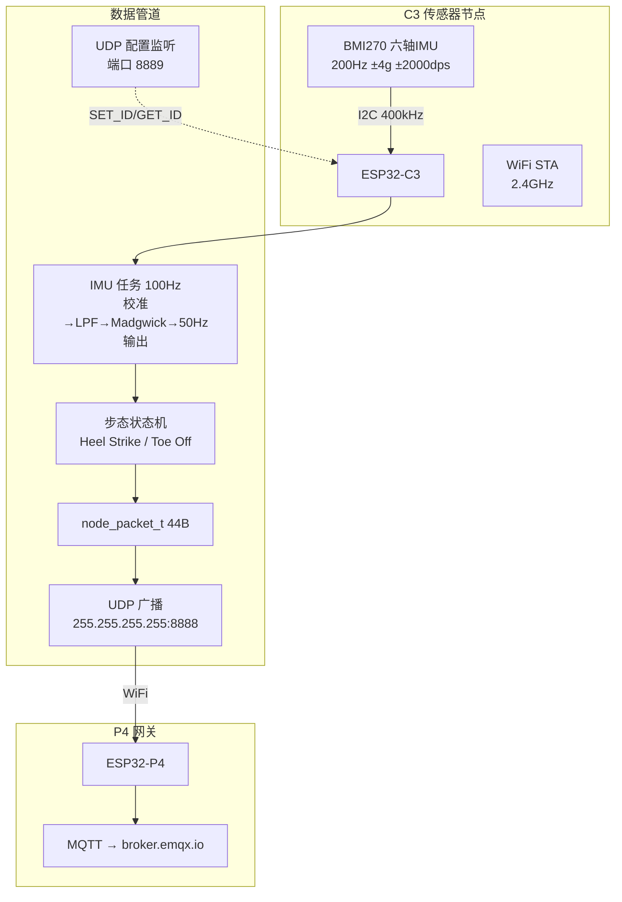

# smartKepp_C3 项目文档

## 项目概览

| 属性 | 值 |
|:---|:---|
| 项目名称 | smartKepp_C3 |
| 目标芯片 | ESP32-C3 (RISC-V, 160MHz, 无 FPU) |
| 开发框架 | ESP-IDF v5.5.3 |
| 串口 | COM3 |
| 项目阶段 | **功能完成** — IMU 姿态解算 + 步态检测 + UDP 传输 + 多节点支持 |

---

## 系统架构图



---

## 引脚分配表

| 引脚 | 功能 | 类型 | 备注 |
|:---|:---|:---|:---|
| **GPIO2** | 电池电压采样 | ADC 输入 | Strapping 引脚，仅输入 |
| **GPIO4** | I2C SDA | 数据线 | BMI270 |
| **GPIO5** | I2C SCL | 时钟线 | BMI270 |
| **GPIO6** | 蜂鸣器 | GPIO 输出 | 低电平有源蜂鸣器，LOW=响 HIGH=停 |

> **BMI270 I2C 地址**: `0x68`（SDO→GND）或 `0x69`（SDO→VCC）

---

## 目录结构

```
smartKepp_C3/
├── CLAUDE.md                 ← 本文件
├── CMakeLists.txt
├── sdkconfig
├── dependencies.lock
│
├── main/
│   ├── main.c                ← 完整固件 (~900行, 15个模块段)
│   ├── node_config.h         ← 节点 ID 配置 API
│   ├── node_config.c         ← NVS 存储 + UDP 远程配置
│   ├── CMakeLists.txt
│   └── idf_component.yml
│
├── tools/
│   ├── udp_receiver.py       ← PC 端 UDP 直接接收 (调试用)
│   └── mqtt_subscriber.py    ← PC 端 MQTT 订阅 (经 P4 网关)
│
├── docs/
│   └── UDP_RECEIVER_API.md   ← UDP 接收端对接文档
│
├── managed_components/       ← 第三方组件 (勿手动修改)
│   └── nicolaielectronics__bmi270/
│
└── WORK_REPORT.md            ← 设计工作报告
```

---

## main.c 模块段索引

| 段 | 名称 | 说明 |
|:---:|:---|:---|
| §1 | 配置宏 | 引脚、量程、WiFi、UDP、阈值 |
| §2 | node_packet_t | 44 字节数据包定义 |
| §3 | 全局状态 | BMI270 设备、I2C、四元数、队列 |
| §4 | CRC-8 | poly=0x07 校验 |
| §5 | 单位换算 | LSB → m/s², °/s |
| §6 | IIR LPF | 一阶低通 (α_acc=0.3, α_gyr=0.5) |
| §7 | Madgwick AHRS | 6 轴四元数滤波 |
| §8 | 四元数→欧拉角 | ZYX 顺序 |
| §9 | WiFi STA | 自动重连 + 断连原因打印 |
| §10 | UDP 发送任务 | 队列消费 + SO_BROADCAST |
| §10.5 | 蜂鸣器驱动 | 低电平有源，GPIO6，init/on/off/beep/beep_n |
| §11 | I2C 初始化 | 新驱动 i2c_master.h |
| §12 | BMI270 初始化 | 200Hz, ±4g, ±2000dps |
| §13 | IMU 管道任务 | 校准→收敛→运行→步态检测 |
| §14 | app_main | 启动流程 |

---

## 节点配置模块

| 功能 | API |
|:---|:---|
| 初始化 (NVS 加载) | `node_config_init()` → 返回 ID 1~5 |
| 获取当前 ID | `node_config_get_id()` |
| 设置并保存 | `node_config_set_id(id)` |
| UDP 远程配置 | `node_config_start_udp_listener()` 端口 8889 |

首次上电默认 ID=1，PC 端通过 UDP 远程修改。

---

## 网络架构

```
C3 节点 (×5) ──UDP 8888──► P4 网关 ──MQTT──► broker.emqx.io ──► PC/服务器

C3 配置端口: UDP 8889 (SET_ID / GET_ID)
```

**WiFi 配置:** SSID=`djrs`, PASS=`2661760820`

---

## 构建与烧录

```bash
idf.py set-target esp32c3
idf.py build
idf.py -p COM3 flash monitor
```

---

## 编码规范

- **缩进**: 4 空格
- **命名**: `snake_case` (函数/变量), `UPPER_SNAKE_CASE` (宏)
- **日志**: `ESP_LOGI/W/E(TAG, ...)`, TAG = "smartKeep"
- **注释语言**: 与现有代码保持一致 (中文)

---

## 元信息

| 属性 | 值 |
|:---|:---|
| 文档版本 | v2.0.0 |
| 更新时间 | 2026-04-03 |
