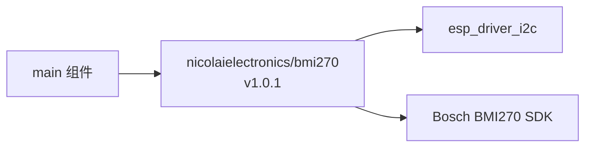

# main 模块文档

[根](../CLAUDE.md) > **main**

---

## 模块概览

| 属性 | 值 |
|:---|:---|
| 模块路径 | `main/` |
| 模块职责 | 应用程序主入口，系统初始化与主循环 |
| 当前状态 | **空壳** — 仅包含空 `app_main()` 函数 |

---

## 文件清单

| 文件 | 说明 | 状态 |
|:---|:---|:---|
| `main.c` | 应用入口，包含 `app_main()` | 待实现 |
| `CMakeLists.txt` | 组件构建配置 | 已配置 |
| `idf_component.yml` | 组件依赖声明 | 已配置 BMI270 |

---

## 依赖关系



### idf_component.yml 依赖声明

```yaml
dependencies:
  idf: '>=4.1.0'
  nicolaielectronics/bmi270: ^1.0.1
```

---

## 当前代码状态

```c
// main/main.c（当前内容）
#include <stdio.h>

void app_main(void)
{
    // 空实现
}
```

---

## 待实现功能列表

### 优先级 P0（当前目标）

- [ ] I2C 主机总线初始化
- [ ] BMI270 传感器初始化
- [ ] 加速度计/陀螺仪启用与配置
- [ ] 传感器数据读取测试

### 优先级 P1（后续功能）

- [ ] 蜂鸣器 PWM 驱动（GPIO6）
- [ ] 电池电压 ADC 采样（GPIO2）
- [ ] 传感器数据处理逻辑

### 优先级 P2（进阶功能）

- [ ] 低功耗模式
- [ ] 运动检测中断
- [ ] 步数计数器

---

## I2C 初始化步骤参考

### 步骤 1: 包含头文件

```c
#include <stdio.h>
#include "freertos/FreeRTOS.h"
#include "freertos/task.h"
#include "driver/i2c_master.h"
#include "esp_log.h"

// BMI270 驱动
#include "bmi270.h"
#include "bmi270_interface.h"
```

### 步骤 2: 定义引脚和地址

```c
#define I2C_SDA_PIN         GPIO_NUM_4
#define I2C_SCL_PIN         GPIO_NUM_5
#define BMI270_I2C_ADDR     0x68    // SDO 接 GND；若接 VCC 则为 0x69

static const char *TAG = "smartKeep";
```

### 步骤 3: 初始化 I2C 主机总线

```c
static i2c_master_bus_handle_t i2c_bus_init(void)
{
    i2c_master_bus_config_t bus_config = {
        .i2c_port = I2C_NUM_0,
        .sda_io_num = I2C_SDA_PIN,
        .scl_io_num = I2C_SCL_PIN,
        .clk_source = I2C_CLK_SRC_DEFAULT,
        .glitch_ignore_cnt = 7,
        .flags.enable_internal_pullup = true,  // 启用内部上拉（若外部已有上拉可设为 false）
    };
    
    i2c_master_bus_handle_t bus_handle;
    esp_err_t ret = i2c_new_master_bus(&bus_config, &bus_handle);
    if (ret != ESP_OK) {
        ESP_LOGE(TAG, "I2C 总线初始化失败: %s", esp_err_to_name(ret));
        return NULL;
    }
    
    ESP_LOGI(TAG, "I2C 总线初始化成功");
    return bus_handle;
}
```

---

## BMI270 初始化流程参考

### 完整初始化函数

```c
static struct bmi2_dev bmi2_dev;

static int8_t bmi270_sensor_init(i2c_master_bus_handle_t bus_handle)
{
    int8_t rslt;
    
    // 1. 配置 I2C 连接参数
    bmi2_set_i2c_configuration(bus_handle, BMI270_I2C_ADDR, NULL);
    
    // 2. 初始化 BMI270 接口（填充 bmi2_dev 结构体）
    rslt = bmi2_interface_init(&bmi2_dev, BMI2_I2C_INTF);
    if (rslt != BMI2_OK) {
        ESP_LOGE(TAG, "BMI270 接口初始化失败");
        bmi2_error_codes_print_result(rslt);
        return rslt;
    }
    
    // 3. 初始化 BMI270 传感器（加载配置文件）
    rslt = bmi270_init(&bmi2_dev);
    if (rslt != BMI2_OK) {
        ESP_LOGE(TAG, "BMI270 传感器初始化失败");
        bmi2_error_codes_print_result(rslt);
        return rslt;
    }
    
    ESP_LOGI(TAG, "BMI270 初始化成功");
    return BMI2_OK;
}
```

### 启用加速度计和陀螺仪

```c
static int8_t bmi270_enable_sensors(void)
{
    int8_t rslt;
    
    // 要启用的传感器列表
    uint8_t sensor_list[2] = { BMI2_ACCEL, BMI2_GYRO };
    
    // 启用传感器
    rslt = bmi2_sensor_enable(sensor_list, 2, &bmi2_dev);
    if (rslt != BMI2_OK) {
        ESP_LOGE(TAG, "传感器启用失败");
        bmi2_error_codes_print_result(rslt);
        return rslt;
    }
    
    ESP_LOGI(TAG, "加速度计和陀螺仪已启用");
    return BMI2_OK;
}
```

### 配置传感器参数（可选）

```c
static int8_t bmi270_configure_sensors(void)
{
    int8_t rslt;
    struct bmi2_sens_config config[2];
    
    // 加速度计配置
    config[0].type = BMI2_ACCEL;
    config[0].cfg.acc.odr = BMI2_ACC_ODR_100HZ;      // 100Hz 输出数据率
    config[0].cfg.acc.range = BMI2_ACC_RANGE_4G;     // +/- 4g 量程
    config[0].cfg.acc.bwp = BMI2_ACC_NORMAL_AVG4;    // 正常模式
    config[0].cfg.acc.filter_perf = BMI2_PERF_OPT_MODE;
    
    // 陀螺仪配置
    config[1].type = BMI2_GYRO;
    config[1].cfg.gyr.odr = BMI2_GYR_ODR_100HZ;      // 100Hz 输出数据率
    config[1].cfg.gyr.range = BMI2_GYR_RANGE_2000;   // +/- 2000 dps 量程
    config[1].cfg.gyr.bwp = BMI2_GYR_NORMAL_MODE;    // 正常模式
    config[1].cfg.gyr.noise_perf = BMI2_PERF_OPT_MODE;
    config[1].cfg.gyr.filter_perf = BMI2_PERF_OPT_MODE;
    
    rslt = bmi2_set_sensor_config(config, 2, &bmi2_dev);
    if (rslt != BMI2_OK) {
        ESP_LOGE(TAG, "传感器配置失败");
        bmi2_error_codes_print_result(rslt);
        return rslt;
    }
    
    ESP_LOGI(TAG, "传感器配置完成");
    return BMI2_OK;
}
```

### 读取传感器数据

```c
static void bmi270_read_data(void)
{
    int8_t rslt;
    struct bmi2_sens_data sensor_data = { 0 };
    
    rslt = bmi2_get_sensor_data(&sensor_data, &bmi2_dev);
    if (rslt == BMI2_OK) {
        ESP_LOGI(TAG, "加速度: X=%d, Y=%d, Z=%d",
                 sensor_data.acc.x, sensor_data.acc.y, sensor_data.acc.z);
        ESP_LOGI(TAG, "陀螺仪: X=%d, Y=%d, Z=%d",
                 sensor_data.gyr.x, sensor_data.gyr.y, sensor_data.gyr.z);
    } else {
        bmi2_error_codes_print_result(rslt);
    }
}
```

---

## 完整 app_main 示例

```c
void app_main(void)
{
    ESP_LOGI(TAG, "smartKeep 启动");
    
    // 1. 初始化 I2C 总线
    i2c_master_bus_handle_t bus_handle = i2c_bus_init();
    if (bus_handle == NULL) {
        ESP_LOGE(TAG, "系统初始化失败");
        return;
    }
    
    // 2. 初始化 BMI270
    if (bmi270_sensor_init(bus_handle) != BMI2_OK) {
        ESP_LOGE(TAG, "BMI270 初始化失败");
        return;
    }
    
    // 3. 启用传感器
    if (bmi270_enable_sensors() != BMI2_OK) {
        ESP_LOGE(TAG, "传感器启用失败");
        return;
    }
    
    // 4. 配置传感器（可选）
    bmi270_configure_sensors();
    
    // 5. 主循环：周期读取数据
    while (1) {
        bmi270_read_data();
        vTaskDelay(pdMS_TO_TICKS(100));  // 100ms 间隔
    }
}
```

---

## 常见问题

### Q: I2C 通信失败？

1. 检查接线：SDA(GPIO4)、SCL(GPIO5)
2. 确认 BMI270 供电正常（1.8V 或 3.3V）
3. 确认 I2C 地址：SDO 接 GND 为 `0x68`，接 VCC 为 `0x69`
4. 检查是否有外部上拉电阻（推荐 4.7kΩ）

### Q: BMI270 初始化返回错误？

- `BMI2_E_NULL_PTR`: 传入了空指针
- `BMI2_E_COM_FAIL`: I2C 通信失败
- `BMI2_E_DEV_NOT_FOUND`: 设备未响应，检查地址和接线

---

## 元信息

| 属性 | 值 |
|:---|:---|
| 生成时间 | 2026-04-02 20:44:22 |
| 父文档 | [根级 CLAUDE.md](../CLAUDE.md) |
